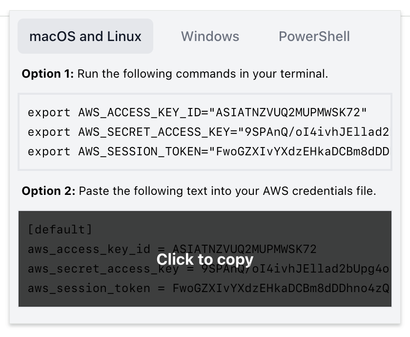

# AWS SAML to STS Chrome extension

[](https://github.com/unfunco/chrome-ext-aws-saml-sts/actions/workflows/ci.yaml)
[](https://opensource.org/licenses/Apache-2.0)

[Google Chrome] extension that intercepts the SAML assertion when logging into
the [AWS] console and exchanges it for temporary [STS] credentials.



In organisations using directory services like Active Directory and
authenticating with AWS through a SAML 2.0 identity provider, there is sometimes
a lack of tooling for generating temporary credentials to use with the [AWS CLI]
or SDKs. This extension makes temporary credentials available for copy whenever
you sign in to the AWS console.

## Getting started

### Installation and usage

**Add to Chrome** from the [Chrome Web Store].

Sign in to the AWS console as you normally would, and once you've signed in,
click the extension icon in the toolbar and ensure your preferred platform is
selected, then click either of the code snippets to copy the temporary
credentials to your clipboard.

Credentials are valid per the duration specified by the identity provider, they
will automatically be removed from local storage when they expire and will no
longer be visible in the user interface.

### Development and testing

If you want to work on the plugin, or if your organisation blocks access to the
Chrome Web Store, you can build and install the extension manually using the
following instructions.

#### Requirements

- [Google Chrome]
- [Node.js] 20 and [npm] 9+

Clone the repository and navigate to the `chrome-ext-aws-saml-sts` directory,
and install dependencies with [npm]. This will take a minute or two.

```bash
git clone git@github.com:unfunco/chrome-ext-aws-saml-sts.git
cd chrome-ext-aws-saml-sts
npm install
```

Once the dependencies have been installed, you can start the development server
which will watch for changes and rebuild the extension when necessary. When the
development server is running, you can load the extension into Chrome by
navigating to [chrome://extensions], enabling developer mode, and clicking
"Load unpacked" to select the `dist` directory.

```bash
npm run dev
```

When you're ready to build the extension for distribution, you can run the build
script which will create a `dist` directory containing the extension files. You
can then package the extension and distribute it as you see fit, or load it into
Chrome for use on your own machine.

```bash
npm run build
```

Alternatively, if you don't want to build the extension yourself, you can
download the latest distribution from the relevant GitHub release.

## License

© 2023 [Daniel Morris]\
Made available under the terms of the [Apache License 2.0].

[apache license 2.0]: LICENSE.md
[aws]: https://aws.amazon.com
[aws cli]: https://aws.amazon.com/cli/
[chrome://extensions]: chrome://extensions
[chrome web store]: https://chromewebstore.google.com/detail/aws-saml-to-sts/affnlpfpepgmjfhclafkknonoocdefnh
[daniel morris]: https://unfun.co
[google chrome]: https://www.google.com/chrome
[node.js]: https://nodejs.org
[npm]: https://www.npmjs.com
[sts]: https://docs.aws.amazon.com/STS/latest/APIReference/welcome.html
