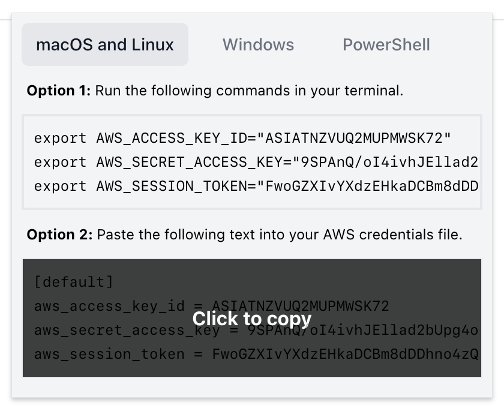

# AWS SAML to STS Chrome extension

[](https://github.com/unfunco/chrome-ext-aws-saml-sts/actions/workflows/ci.yaml)
[](https://opensource.org/licenses/MIT)

A [Google Chrome] extension for engineers who authenticate to [AWS] with
SAML 2.0 and want temporary [STS] credentials they can copy into the
[AWS CLI] or AWS SDK tooling.



When you sign in to the AWS console through a SAML identity provider such as
Okta, Azure AD, or ADFS, AWS receives a SAML assertion at
`https://signin.aws.amazon.com/saml`. This extension intercepts that assertion,
extracts the IAM role details, exchanges the assertion for temporary AWS STS
credentials, and makes the credentials available in copy-friendly formats.

## Why this exists

Federated AWS access often works well in the browser but leaves a gap for local
developer workflows. If your organisation uses SAML sign-in for the AWS
console, getting short-lived credentials into the CLI or SDKs can still be
awkward. This extension closes that gap without adding another service or
credential broker.

## How the extension works

1. It listens only for requests to `https://signin.aws.amazon.com/saml`.
2. It reads the posted `SAMLResponse` from the AWS sign-in form submission.
3. It parses the available IAM roles and optional session duration from the
   SAML assertion.
4. It calls AWS STS `AssumeRoleWithSAML` for the selected role.
5. It stores the resulting temporary credentials in extension local storage
   until they expire, then automatically removes them.

If the assertion contains exactly one role, credentials are generated
immediately. If AWS presents a role selection screen, credentials are generated
after you choose a role and complete sign-in.

## Installation and usage

The easiest option is to install the extension from the [Chrome Web Store].

After installation:

1. Sign in to the AWS console as you normally would.
2. Open the extension from the browser toolbar.
3. Choose your preferred credential format.
4. Click a snippet to copy it to your clipboard.

### Credential output formats

The popup currently exposes four formats:

- `macOS/Linux`: shell exports for terminal sessions
- `Windows CMD`: `SET` commands for Command Prompt
- `PowerShell`: `$Env:` assignments
- `AWS credentials file`: an INI snippet for `~/.aws/credentials`

The credentials file snippet is emitted as `[default]`. If you prefer a named
profile, rename the profile header after copying.

### Requirements and compatibility

This extension is intended for AWS accounts that use SAML 2.0 federation with
IAM roles. It is a good fit for setups backed by providers such as Okta, Azure
AD, ADFS, Keycloak, Ping Identity, or similar SAML-capable IdPs.

It is **not** designed for AWS IAM Identity Center / AWS SSO flows.

## Security and privacy

This project is intentionally narrow in scope:

- The extension only requests `webRequest` and `storage` permissions.
- It only declares host access to `https://signin.aws.amazon.com/saml`.
- Credentials are stored in extension local storage on your machine.
- Expired credentials are automatically removed and hidden from the UI.
- The extension does not send telemetry or forward credentials to any service
  other than AWS STS.

### Permissions

| Permission                           | Why it is needed                                                                                |
| ------------------------------------ | ----------------------------------------------------------------------------------------------- |
| `webRequest`                         | Intercept the AWS SAML sign-in POST before AWS finishes the console login flow                  |
| `storage`                            | Persist the selected platform and temporary credentials between the background worker and popup |
| `https://signin.aws.amazon.com/saml` | Limit interception to the AWS SAML endpoint instead of broad host access                        |

### Operational notes

- Anyone with access to your browser profile or extension storage can inspect
  stored credentials while they are still valid.
- Credentials are temporary and expire according to the duration granted by
  your identity provider / AWS role configuration.
- The extension does not automatically refresh credentials; you refresh them by
  signing in to AWS again.

## Development

If your organisation blocks the Chrome Web Store, or you want to work on the
extension locally, you can build and install it manually.

### Requirements

- [Google Chrome] or another Chromium-based browser
- [Node.js] matching the repository's `.node-version` file
- [npm] 10+

### Local setup

```bash
git clone git@github.com:unfunco/chrome-ext-aws-saml-sts.git
cd chrome-ext-aws-saml-sts
npm install
```

### Development workflow

Start the local watcher:

```bash
npm run dev
```

This runs `nodemon`, which rebuilds the extension with Vite when files change.

Then load the unpacked extension:

1. Open [chrome://extensions]
2. Enable **Developer mode**
3. Click **Load unpacked**
4. Select the repository's `dist` directory

When you change source files, rebuilds happen automatically, but you still need
to reload the extension in Chrome to pick up the updated bundle.

### Validation commands

Run the same checks used for release preparation:

```bash
npm run lint
npm test
npm run build
```

You can also check formatting explicitly:

```bash
npm run fmt:check
```

### Building for distribution

Create a production build with:

```bash
npm run build
```

That produces a `dist` directory containing the packaged extension assets.

If you do not want to build locally, you can also download a packaged build from
the project's [GitHub releases](https://github.com/unfunco/chrome-ext-aws-saml-sts/releases).

## Troubleshooting

### I signed in to AWS but no credentials appeared

- Make sure the extension is enabled and pinned in the browser toolbar.
- If AWS asked you to choose between multiple roles, finish that selection
  first, then reopen the popup.
- Open the service worker console from [chrome://extensions] to inspect logs
  from the background worker.

### The credentials are expired

Expired credentials are removed automatically. Sign in to AWS again to generate
a fresh set.

### The AWS credentials file snippet uses `[default]`

That is the current built-in format. If you need a named profile, rename the
header after copying and save it to `~/.aws/credentials`.

### I am debugging locally and want to inspect the background worker

From [chrome://extensions], open the extension details card and click the
service worker link to inspect the Manifest V3 background worker logs.

## FAQ

### Does this support multiple AWS partitions?

Yes. The role parsing logic supports the standard commercial AWS partition and
other AWS IAM role ARN partitions such as GovCloud-style ARNs.

### Does this modify pages in the browser?

No. The extension listens for the AWS sign-in request and renders its own popup
UI, but it does not inject scripts into arbitrary web pages.

### Can this refresh credentials automatically?

No. This extension captures credentials when you sign in to AWS through the
browser. It does not run a background renewal workflow.

## License

© 2023 [Daniel Morris]\
Made available under the terms of the [MIT License].

[aws]: https://aws.amazon.com
[aws cli]: https://aws.amazon.com/cli/
[chrome://extensions]: chrome://extensions
[chrome web store]: https://chromewebstore.google.com/detail/aws-saml-to-sts/affnlpfpepgmjfhclafkknonoocdefnh
[daniel morris]: https://unfun.co
[google chrome]: https://www.google.com/chrome
[mit license]: LICENSE.md
[node.js]: https://nodejs.org
[npm]: https://www.npmjs.com
[sts]: https://docs.aws.amazon.com/STS/latest/APIReference/welcome.html
